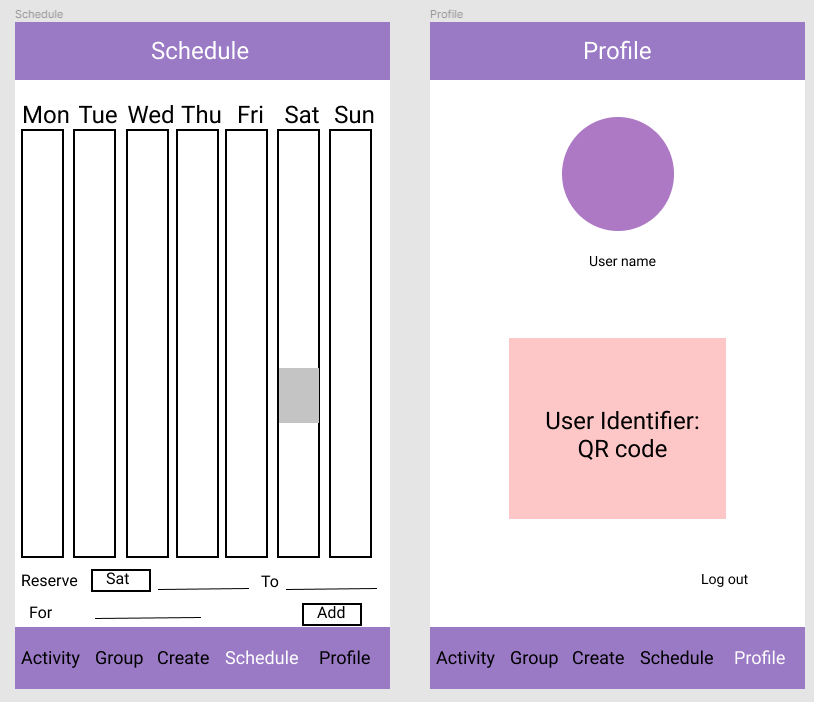

# Weekend Activity App

## Table of Contents
1. [Overview](#Overview)
1. [Product Spec](#Product-Spec)
1. [Wireframes](#Wireframes)
2. [Schema](#Schema)

## Overview
### Description
[Description of your app]
This app is aimmed at help users to plan activity to do with friends in an aided fashion: to remove repeat work to ask through text back and forth for when and where for some fun activities.
### App Evaluation
[Evaluation of your app across the following attributes]
- **Category:** Productivity, Social networking
- **Mobile:** This is particular beneficial with the real time, camera, location functions in the mobile phone and convenient for users to use their phone to check schedules and create activities.
- **Story:** Automate availability to be shared among group members for determining the activity schedule
- **Market:** Any individual who looks for an efficient way to organize activities.
- **Habit:** weekly for activity planners
- **Scope:** V1 we would like to import calendar modules to allow users to view their schedules and manipulate on their calendar V2 Integrate functionality of creating groups and filtering of common available time for a group of users for an activity V3 Users will be able to view upcoming activities (notified to them through group notification function and also available in their schedule) and manipulate on their attendence preference V4 (Stretch) create reusable activity icons for user to drag to the calendar

## Product Spec

### 1. User Stories (Required and Optional)

**Required Must-have Stories**

* User can log in (make it login with Google)
* User can create a new account
* User can view future activities and past attended activities
* User can set their attendence preference
* User can form/join groups 
* User can setup an activity in a group with activity specifics (min/max number of participants, locations, fees) 
* Schedule of users of a group will be automatically mapped together for filtering down a time common for most people, (maybe return a list of time options and number of available participants)
* User can operate on their calendar, like show available time, grey out unavailable time

**Optional Nice-to-have Stories**

* Make the app more user friendly (UX design)
* Users can join groups using QR codes
* User can drag items to their activity
* User can add profile pic to their username
* User can do a pull to refresh for latest changes
* User can load more comments using infinite scrolling
* Users can comment on the activity 

### 2. Screen Archetypes

* Login Screen
   * User can login
* Registration Screen
   * User can create a new account
* Activity Screen (Stream Screen)
   * User can view future activities and past attended activities
   * User can set their attendence preference
* Group Screen 
   * User can form/join groups 
* Creation Screen
   * User can setup an activity in a group with activity specifics (min/max number of participants, locations, fees) 
   * Schedule of users of a group will be automatically mapped together for filtering down a time common for most people, (maybe return a list of time options and number of available participants)
* Schedule Screen
   * User can operate on their calendar, like show available time, grey out unavailable time
### 3. Navigation

**Tab Navigation** (Tab to Screen)

* Activity: check out available activities and past attended activities
* Group: show groups joined and create new groups
* Create: compose a new activity
* Schedule: change schedule 
* Profile: manage profile image, log out

**Flow Navigation** (Screen to Screen)

* Login Screen
    => Activity
* Registration Screen
    => Activity
* Activity Screen
    => None, but future version will likely involve navigation to a detailed screen to see comments/photos (for past attended activities).
* Creation Screen
    => Activity (after you finished creating activities)
    => In the actual wireframe, you will need multiple screens to represent the creation process to add filters, etc.
* Group Screen
    => None, but future version will likely involve navigation to a detailed screen to see comments/photos (for past attended activities).
* Profile Screen
    => Login (after click on log out)
    => None, but future version will likely involve navigation to a edit screen to change profile image.

## Wireframes
[Add picture of your hand sketched wireframes in this section]

### [BONUS] Digital Wireframes & Mockups
  

### [BONUS] Interactive Prototype

## Schema 

### com.example.weekendactivity.Models
1. [User](#User)
2. [Group](#Group)
3. [Activity](#Activity)
4. [Comment](#Comment)

Reference: [Supported Parse Data Types](https://docs.parseplatform.org/rest/guide/#data-types)
#### User
|Property	| Type	| Description |
|----|----|----|
|userId	| String	| unique id for the user (default field) |
|userName | String | username for login | 
|screenName | String	| display name for a user |
|profileImage|	File	| user profile image |
|userQRCode | File | user QR code for adding to a group|
|groups | List<[Group](#Group)> | a list of groups joined|
|activities | List<[Activity](#Activity)> |a list of activities notified, attended| 
|createAt | DateTime | date when user is created (default field) |

#### Group
|Property	| Type	| Description |
|----|----|----|
|groupId |String | unique id for the group (default field) |
|groupName | String | display name for a group |
|groupQRcode |File | group QR code for users to identify a group to join |
|description | String | display description of a group |
|managers | List<[User](#User)> | a list of users that manage the groups, propose activities |
|members | List<[User](#User)> | a list of members |
|activities | List<[Activity](#Activity)> | a list of activities |
|createAt | DateTime | date when group is created (default field) |

#### Activity
|Property	| Type	| Description |
|----|----|----|
|activityName | String | display name for an activity |
|groupNotified| Pointer to [Group](#Group)| |
|location | String | |
|date | DateTime | date for the activity |
|membersRegistered | List<[User](#User)> | list of users that registered for the activity| 
|activityStatus | String | "active", "cancelled", "up for vote"|
|comments | List<[Comment](#Comment)> | a list of comments associated with the activity|
|commentsCount	| Number	| number of comments that has been posted to an activity |
| likesCount	| Number |	number of likes for the activity |
| createdAt	| DateTime	| date when post is created (default field) |

#### Comment
|Property	| Type	| Description |
|----|----|----|
|author | Pointer to [User](#User) | pointer to the user who posted the comment |
|content| String | comment to the activity |
|image | File | image around the activity|
|createdAt| DateTime | date when post is created (default field) |

### Networking
#### [Add list of network requests by screen]
#### [Create basic snippets for each Parse network request]
- Login Screen
    - (READ/GET) login details
- Registration Screen
    - (CREATE/POST) username and password
    - (READ/GET) login with Google
- Activty Screen
    - (READ/GET) Query event details from Activities
- Creation Screen
	- (CREATE/POST) add events
	- (UPDATE/PUT) Update event details like location, time, participants
	- (DELETE) delete the event
- Group Screen
	- (READ/GET) Query the group name with participants
- Profile Screen
    - (Read/GET) Query logged in user object
#### [OPTIONAL: List endpoints if using existing API such as Yelp]
